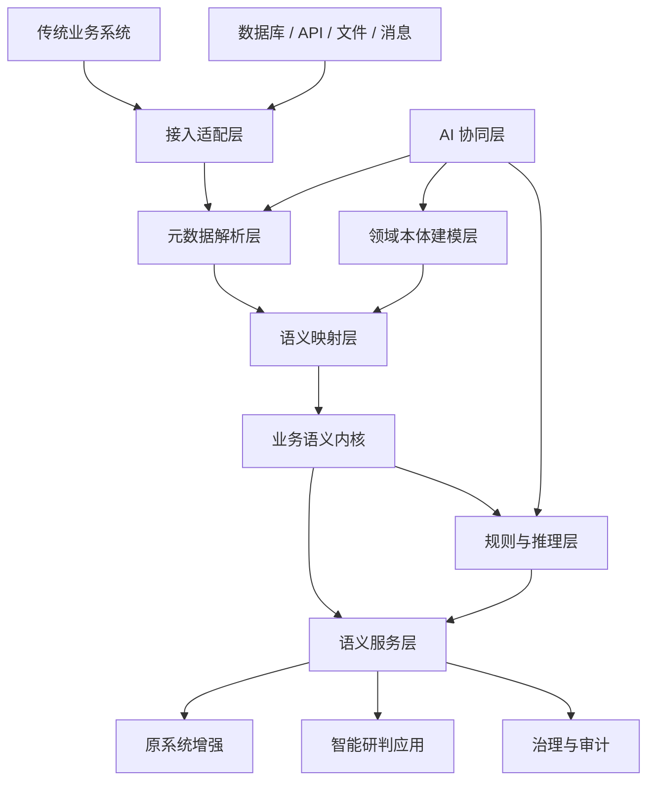

# 本体改造研发平台总体架构

## 1. 目标定位

本体改造研发平台的目标不是替换传统业务系统，而是为传统业务系统安装一个可演进的“业务语义内核”。

平台应支持快速接入各行业领域已有的数据库、接口、流程和业务规则，将原本分散在表结构、代码、页面、报表和人员经验中的业务含义抽取出来，形成可解释、可治理、可推理、可复用的领域本体，并通过语义服务反向增强原业务系统。

最终目标包括：

1. 让系统理解业务对象、关系、状态和约束，而不只是保存表记录。
2. 让业务规则从代码和人工经验中外显出来，支持版本化、审计和影响分析。
3. 让跨系统、跨表、跨流程的一致性判断可自动执行。
4. 让业务操作、风险研判和治理动作具备统一依据。
5. 让行业改造经验沉淀为可复用的本体模板、映射模板和规则模板。

## 2. 核心原则

### 2.1 旁侧增强优先

首版平台应优先采用旁侧增强架构，而不是直接侵入传统业务系统核心代码。平台通过数据库只读接入、接口接入、事件订阅和 API 回写逐步增强系统能力。

这样可以降低实施阻力，也便于在多个行业系统中复用。

### 2.2 人机协同建模

平台可以自动分析表结构、字段、枚举、关系和数据分布，但不能假设自动生成的本体一定正确。领域本体必须支持专家校验、版本管理和变更审批。

### 2.3 语义优先，数据不搬家

平台不应在早期强制建设一个新的大而全数据库。首要任务是建立语义映射和语义服务，让传统系统的数据在原位置也能被语义化理解。

### 2.4 可解释优先

规则推理、风险判断、操作建议和自动化决策必须能说明依据，包括引用了哪些业务对象、关系、规则、版本和原始数据。

### 2.5 从行业闭环中抽象通用能力

平台的通用性不能凭空设计，应从一个行业 MVP 闭环中提炼：先证明一个具体场景，再抽象平台能力。

## 3. 分层架构

## 4. 关键模块

### 4.1 接入适配层

负责连接传统业务系统的数据与能力来源。

首版支持范围：

1. 关系型数据库接入：MySQL、PostgreSQL 优先，后续扩展 Oracle、SQL Server、达梦、人大金仓等。
2. 表结构采集：库、表、字段、索引、主键、外键、注释、字段类型、默认值。
3. 数据画像采集：空值率、唯一值、枚举候选、字段样例、值域分布。
4. API 接入：OpenAPI 文档导入或人工注册接口。
5. 文件接入：CSV、Excel、JSON，用于样例系统和行业模板导入。

### 4.2 元数据解析层

负责从传统系统中提取可用于建模的线索。

能力包括：

1. 表关系识别：显式外键、命名约定、字段值匹配、关联表识别。
2. 业务对象候选识别：根据表名、字段组、主数据特征和使用频率识别候选对象。
3. 状态字段识别：枚举、状态码、流程节点、启停标记、审核状态等。
4. 时间字段识别：创建、提交、审核、生效、失效、完成、归档等业务时间。
5. 规则线索识别：非空、唯一、范围、组合约束、枚举约束、跨字段一致性。

### 4.3 领域本体建模层

负责维护领域本体。

核心对象包括：

1. 业务对象：客户、合同、订单、设备、项目等。
2. 属性：业务对象的稳定业务特征。
3. 关系：业务对象之间的拥有、隶属、关联、依赖、触发、约束关系。
4. 事件：申请、提交、审批、签订、入库、出库、报修、结算等。
5. 状态：草稿、待审、有效、冻结、完成、作废等。
6. 规则：校验规则、流转规则、预警规则、决策规则。
7. 术语：业务名称、同义词、禁用词、行业表达。

### 4.4 语义映射层

负责把传统系统结构和领域本体连接起来。

映射类型包括：

1. 表到业务对象的映射。
2. 字段到属性的映射。
3. 字段值到枚举或状态的映射。
4. 关联表到关系的映射。
5. 接口到业务动作的映射。
6. 页面操作到业务事件的映射。
7. SQL 条件到业务规则的映射。

映射必须保留置信度、来源、审核状态和版本。

### 4.5 业务语义内核

业务语义内核是平台的运行时核心，负责统一装载领域本体、语义映射、规则、数据引用和解释链。

它不只是一个知识库，而是一个能够回答“这个数据在业务上意味着什么”“这个操作是否允许”“这个风险为什么产生”“规则变化会影响哪些流程”的运行层。

### 4.6 规则与推理层

首版不应直接追求复杂 OWL 全量推理，而应采用工程上更可控的混合推理方式：

1. 约束校验：必填、唯一、范围、枚举、跨字段一致性。
2. 关系推导：根据映射和规则推导业务对象之间的关系。
3. 状态推导：根据事件和字段变化推导业务状态。
4. 风险识别：根据规则组合识别异常、冲突和缺口。
5. 决策建议：基于规则命中结果给出可解释建议。

后续再引入 RDF/OWL、SHACL、图数据库或 Datalog 类规则引擎。

### 4.7 语义服务层

面向传统系统、管理应用和智能应用提供 API。

首版服务包括：

1. 语义查询：按业务概念查询，而不是只按表字段查询。
2. 语义解释：解释某条记录对应的业务对象、状态、关系和风险。
3. 规则校验：给定业务对象或操作，判断是否合规。
4. 操作建议：基于规则和状态给出下一步动作建议。
5. 影响分析：判断规则、本体或字段映射变化影响哪些对象和服务。

### 4.8 治理与审计层

平台必须记录本体、映射、规则和服务的版本变化。

治理对象包括：

1. 本体版本。
2. 映射版本。
3. 规则版本。
4. 数据源版本。
5. 推理结果版本。
6. 操作审计。
7. 决策解释链。

### 4.9 AI 协同层

AI 用于辅助，不作为最终真值来源。

适合 AI 参与的环节：

1. 根据表结构生成业务对象候选。
2. 根据字段注释和样例数据生成属性解释。
3. 识别同义词、缩写、行业术语。
4. 生成本体草案和规则草案。
5. 辅助解释规则冲突。
6. 生成面向业务人员的说明。

AI 产物必须进入审核流程。

## 5. 推荐技术路线

### 5.1 首版工程栈

建议首版采用务实技术栈：

1. 后端：Python FastAPI 或 Java Spring Boot。
2. 元数据存储：PostgreSQL。
3. 图关系存储：PostgreSQL 递归查询起步，后续可接 Neo4j、NebulaGraph 或 RDF Store。
4. 规则执行：轻量表达式引擎起步，后续扩展 Drools、Datalog、SHACL。
5. 前端：React + TypeScript，用于建模、映射、规则和审计界面。
6. AI 集成：通过可替换模型适配器接入大模型。

### 5.2 不建议首版就做的事

1. 不建议一开始就支持所有数据库。
2. 不建议一开始就做完整 OWL 推理。
3. 不建议一开始就做全行业模板市场。
4. 不建议把 AI 自动生成结果直接写入正式本体。
5. 不建议把传统系统数据全部同步到新平台后再做语义化。

## 6. 首个行业场景建议

首个场景应满足：

1. 有明确传统数据库。
2. 表结构能反映一部分业务含义。
3. 规则较多且变化频繁。
4. 跨表一致性问题明显。
5. 改造收益容易展示。

推荐候选：

1. 合同管理：客户、合同、履约、付款、发票、风险。
2. 设备运维：设备、点检、维修、备件、工单、故障。
3. 项目管理：项目、任务、预算、合同、进度、验收。
4. 供应链采购：供应商、采购单、入库、质检、结算。

首版最推荐“合同管理”或“设备运维”，因为业务对象清晰，规则和状态明显，容易形成演示闭环。

## 7. 成功判据

首版平台应证明以下能力：

1. 能连接一个真实或模拟传统数据库。
2. 能生成业务对象和字段语义候选。
3. 能由人工确认领域本体。
4. 能建立表字段与本体概念的映射。
5. 能配置并执行至少 5 类业务规则。
6. 能对某条业务记录输出语义解释。
7. 能给出可追踪的风险或操作建议。
8. 能通过 API 被原系统或演示应用调用。

