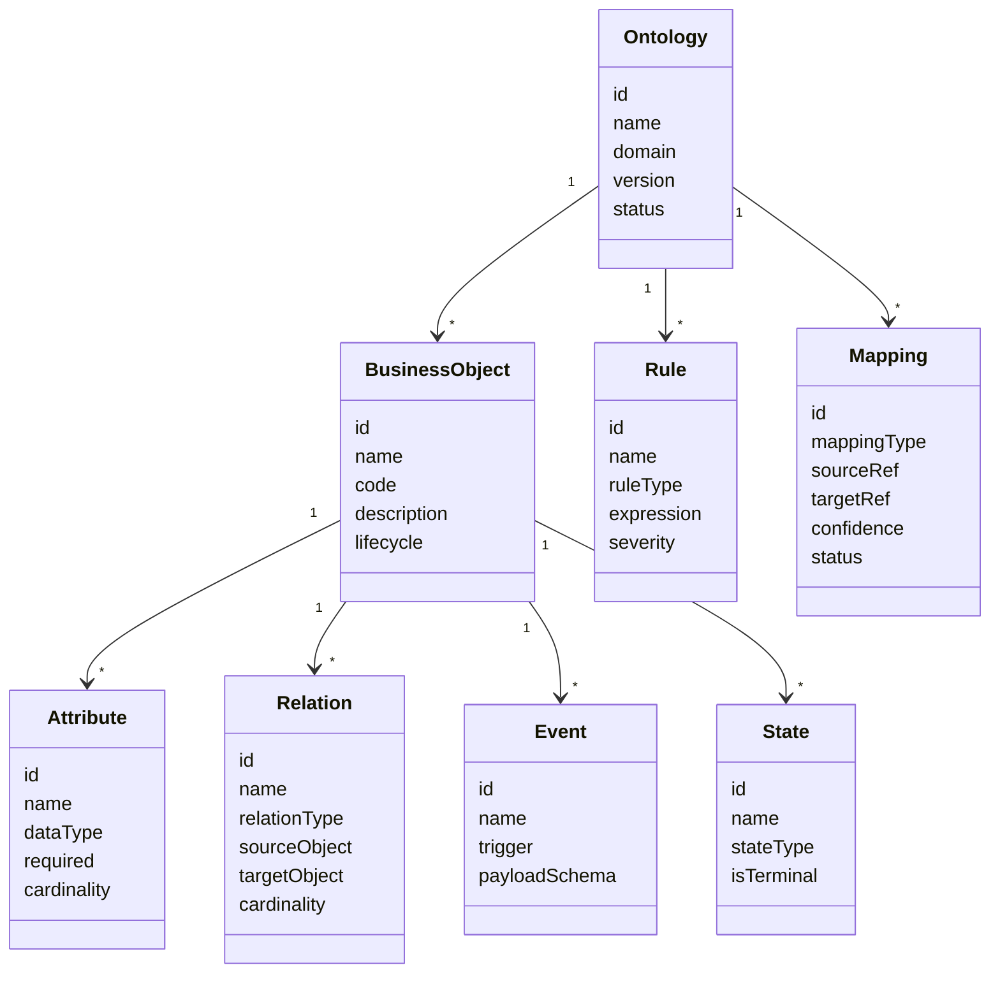

# 核心元模型设计

## 1. 设计目标

核心元模型用于规定平台如何描述不同行业的领域本体。它不是某个行业的业务模型，而是用于承载各行业业务模型的通用骨架。

元模型必须同时满足三类需求：

1. 业务人员能理解：概念、关系、规则和状态必须可解释。
2. 工程系统能执行：映射、规则、推理和 API 必须可运行。
3. 治理过程能追踪：来源、版本、审核、影响和审计必须可管理。

## 2. 元模型总览



## 3. 核心对象

### 3.1 Ontology

领域本体的版本化容器。

关键字段：

| 字段 | 含义 |
| --- | --- |
| id | 本体唯一标识 |
| name | 本体名称 |
| domain | 行业或业务域 |
| version | 版本号 |
| status | 草稿、评审中、已发布、已废弃 |
| owner | 负责人 |
| description | 说明 |

设计要求：

1. 本体必须版本化。
2. 已发布版本不可直接修改，只能派生新版本。
3. 规则、映射和语义服务必须绑定明确的本体版本。

### 3.2 BusinessObject

业务对象是本体中最核心的概念。

示例：

1. 合同。
2. 客户。
3. 设备。
4. 工单。
5. 项目。
6. 供应商。

关键字段：

| 字段 | 含义 |
| --- | --- |
| id | 业务对象唯一标识 |
| ontologyId | 所属本体 |
| code | 稳定编码 |
| name | 中文业务名称 |
| aliases | 同义词和历史名称 |
| description | 业务定义 |
| lifecycle | 生命周期定义 |
| status | 草稿、已确认、已废弃 |

判断标准：

1. 业务人员会自然讨论它。
2. 它有稳定属性。
3. 它能与其他业务对象形成关系。
4. 它可能参与业务规则或流程。

### 3.3 Attribute

属性描述业务对象的业务特征。

示例：

1. 合同金额。
2. 签订日期。
3. 设备编号。
4. 客户等级。

关键字段：

| 字段 | 含义 |
| --- | --- |
| id | 属性唯一标识 |
| objectId | 所属业务对象 |
| name | 属性名称 |
| dataType | 文本、数值、金额、日期、枚举、布尔等 |
| required | 是否必填 |
| cardinality | 单值或多值 |
| unit | 单位 |
| enumSet | 枚举集 |
| sensitivity | 普通、敏感、机密 |

### 3.4 Relation

关系描述业务对象之间的语义连接。

关系类型建议：

1. owns：拥有。
2. belongs_to：隶属。
3. references：引用。
4. depends_on：依赖。
5. produces：产生。
6. consumes：消耗。
7. governs：约束。
8. triggers：触发。

关键字段：

| 字段 | 含义 |
| --- | --- |
| id | 关系唯一标识 |
| sourceObjectId | 起点业务对象 |
| targetObjectId | 终点业务对象 |
| name | 关系名称 |
| relationType | 关系类型 |
| cardinality | 一对一、一对多、多对多 |
| inverseName | 反向关系名称 |
| required | 是否必须存在 |

### 3.5 Event

事件表示业务世界中发生的、有时间点的变化。

示例：

1. 合同提交审批。
2. 设备发生故障。
3. 工单完成。
4. 采购单入库。

关键字段：

| 字段 | 含义 |
| --- | --- |
| id | 事件唯一标识 |
| name | 事件名称 |
| objectId | 主要业务对象 |
| trigger | 触发来源 |
| payloadSchema | 事件载荷结构 |
| occurredAtField | 发生时间字段 |

### 3.6 State

状态表示业务对象在生命周期中的稳定阶段。

示例：

1. 合同：草稿、审批中、已生效、已终止。
2. 工单：待派单、处理中、待验收、已关闭。

关键字段：

| 字段 | 含义 |
| --- | --- |
| id | 状态唯一标识 |
| objectId | 所属业务对象 |
| name | 状态名称 |
| stateType | 初始、中间、终态、异常 |
| isTerminal | 是否终态 |
| source | 字段值、规则推导、事件推导 |

### 3.7 Rule

规则表达可执行的业务判断。

规则类型：

1. validation：校验规则。
2. derivation：推导规则。
3. transition：状态流转规则。
4. risk：风险识别规则。
5. recommendation：建议规则。
6. permission：操作准入规则。

关键字段：

| 字段 | 含义 |
| --- | --- |
| id | 规则唯一标识 |
| ontologyId | 所属本体 |
| name | 规则名称 |
| ruleType | 规则类型 |
| scope | 适用业务对象或关系 |
| expression | 可执行表达式 |
| naturalLanguage | 业务自然语言说明 |
| severity | 提示、警告、阻断 |
| explanationTemplate | 解释模板 |
| status | 草稿、已发布、已停用 |

规则示例：

```text
当合同状态为“已生效”时，合同金额必须大于 0，且签订日期不能为空。
```

### 3.8 Mapping

映射连接传统系统资源与领域本体概念。

映射类型：

1. table_to_object。
2. column_to_attribute。
3. value_to_enum。
4. join_to_relation。
5. api_to_action。
6. page_action_to_event。
7. sql_to_rule。

关键字段：

| 字段 | 含义 |
| --- | --- |
| id | 映射唯一标识 |
| mappingType | 映射类型 |
| sourceSystemId | 来源系统 |
| sourceRef | 表、字段、接口、页面动作等来源引用 |
| targetRef | 本体对象引用 |
| confidence | 自动识别置信度 |
| status | 待确认、已确认、已拒绝、已过期 |
| evidence | 识别依据 |
| reviewer | 审核人 |

## 4. 运行时对象

### 4.1 SemanticInstance

语义实例是传统系统中的一条或多条记录在本体层的业务视图。

示例：

一条 `contract_main` 表记录可以被解释为一个“合同”实例；它关联的 `customer`、`payment_plan`、`invoice` 记录共同构成该合同的语义上下文。

### 4.2 InferenceResult

推理结果记录规则执行或关系推导的结论。

关键字段：

| 字段 | 含义 |
| --- | --- |
| id | 推理结果唯一标识 |
| ruleId | 命中的规则 |
| targetInstance | 目标实例 |
| resultType | 校验、风险、建议、推导关系、推导状态 |
| severity | 严重级别 |
| explanation | 可读解释 |
| evidence | 数据证据 |
| createdAt | 生成时间 |

### 4.3 ExplanationTrace

解释链记录一个结论是如何产生的。

必须包含：

1. 使用的本体版本。
2. 使用的映射版本。
3. 使用的规则版本。
4. 读取的数据来源。
5. 命中的条件。
6. 输出的结论。

## 5. 最小数据库表建议

首版平台自身至少需要以下表：

1. `data_source`：数据源。
2. `source_table`：来源表。
3. `source_column`：来源字段。
4. `ontology`：领域本体。
5. `business_object`：业务对象。
6. `attribute`：属性。
7. `relation`：关系。
8. `event`：事件。
9. `state`：状态。
10. `rule`：业务规则。
11. `semantic_mapping`：语义映射。
12. `rule_execution`：规则执行记录。
13. `inference_result`：推理结果。
14. `explanation_trace`：解释链。
15. `audit_log`：审计日志。

## 6. 关键设计约束

1. 本体、规则、映射必须独立版本化。
2. 自动识别结果必须经过确认后才能进入已发布版本。
3. 每个推理结果必须能追溯到数据、映射、规则和本体版本。
4. 业务对象不等于数据库表，一个业务对象可能来自多张表。
5. 一张表也可能承载多个业务对象或事件。
6. 首版规则表达应优先可解释、可调试，而不是追求表达能力极限。

