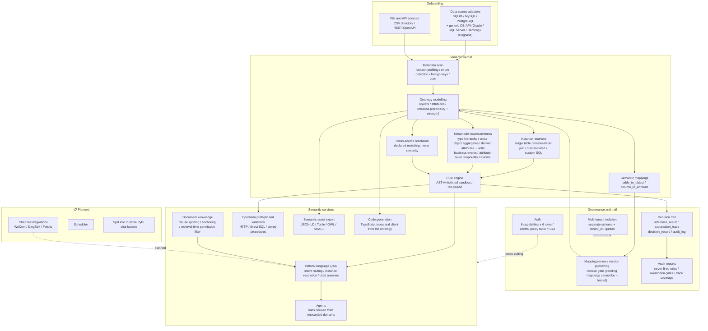

# Architecture

> Layers and data flow. Every layer's status is checked against the code — an architecture
> diagram that labels a shipped capability "planned" makes a reader design around its
> absence, or reject the project for lacking it.

Back to [English README](../README.md) · [中文 README](../README.zh-CN.md)

## Three invariants

These decide why the architecture looks like this, rather than "the layers are tidy".

**A verdict must trace back to a declaration.** The rule engine evaluates declared rules
and infers nothing; relation semantics come from schema declarations and never from data
distribution. So every conclusion points back at something a human declared — which is also
why [full DL reasoning is refused](adr/0005-semantic-generality-ceiling.md).

**Failure to evaluate is a failed verdict.** An expression that cannot be evaluated becomes
"not passed, with a reason" rather than being skipped. A renamed column would otherwise
silently disable a blocking control — exactly the scenario drift detection claims to catch.

**Governance sits on the write path, not beside it.** Publishing is refused while mappings
await review, and `--force` cannot skip it; a knowledge entry cannot be retrieved until it
is confirmed and anchored. A gate that can be bypassed is only advice.

## Related

- [Core concepts](concepts.md) — ontology structure, legacy mapping, the verdict trail
- [Capability matrix](capabilities.md) — per-item status and location
- [Current limitations](limitations.md) — what it cannot do, and why
- [Architecture debt](architecture-debt.md) — remaining technical debt, located
