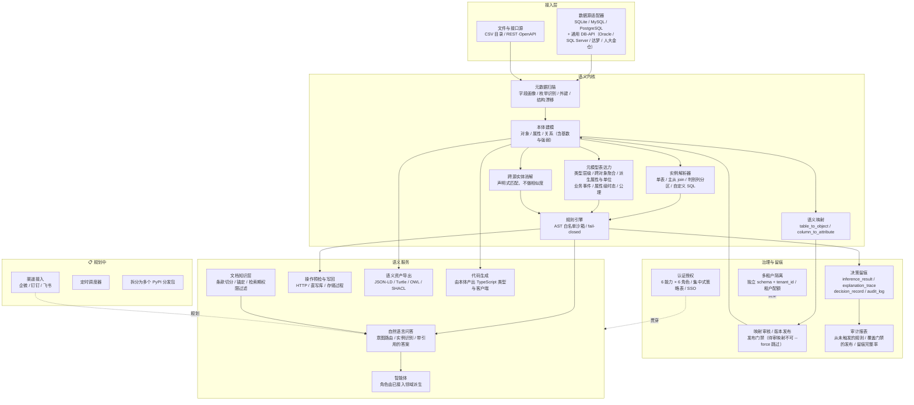

# 架构

> 分层结构与数据流。图中每一层的状态都与代码核对过——
> 一张把已实现能力标为「规划中」的架构图，会让读者绕开它，或据此否决整个项目。

返回 [中文 README](../README.zh-CN.md) · [English README](../README.md)

## 三条不变量

这三条决定了架构为什么长这样，而不是「分层比较整齐」。

**判定必须可回溯到声明。** 规则引擎不做推理，只对声明过的规则求值；
关系语义只从 schema 声明推断，绝不看数据分布。因此每个结论都能指回
某个人做过的声明——这也是[拒绝完整 DL 推理](adr/0005-semantic-generality-ceiling.md)的理由。

**求值失败等于未通过。** 表达式无法求值时判为「不通过 + 原因」，绝不跳过。
字段改名会让阻断级规则静默失效，而那恰恰是结构漂移检测声称要防的场景。

**治理在写入路径上，不在旁路。** 映射未审核则不能发布，且 `--force` 也不能跳过；
知识条目未确认锚定则不可被检索。门禁若可绕过，它就只是一份建议。

## 相关文档

- [核心概念](concepts.zh-CN.md) —— 本体结构、与遗留系统的对应、判定与留痕
- [能力矩阵](capabilities.zh-CN.md) —— 逐项实现状态与位置
- [当前限制](limitations.zh-CN.md) —— 做不到什么，以及为什么
- [架构债](architecture-debt.md) —— 前置技术债逐项定位
